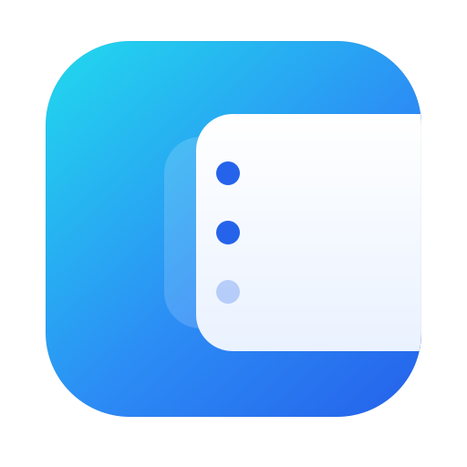
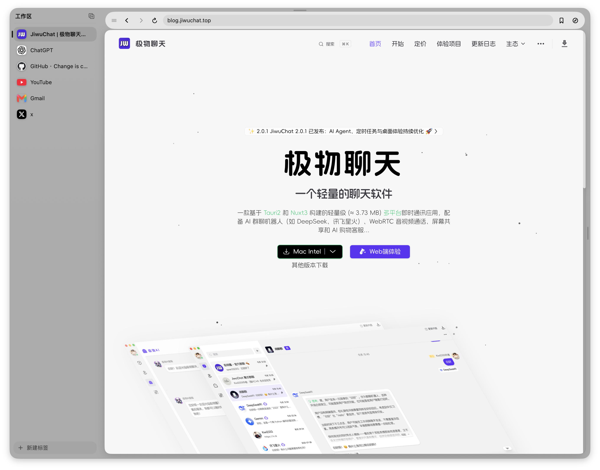
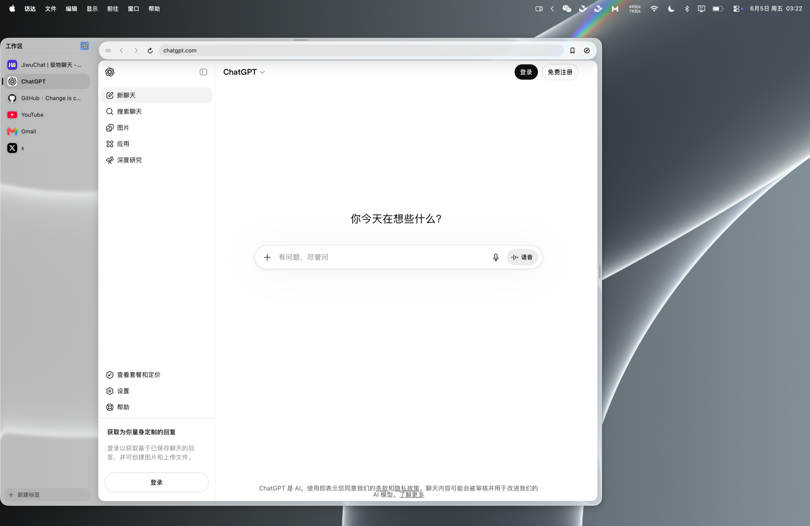

<div align="center">



# Peekr

**A blazing-fast, SlidePad-style slide-over web browser for macOS — dressed in Liquid Glass.**

Pin your web apps to a dock on any screen edge or corner. Flick the cursor there (or hit a hotkey) and the panel *peeks* out — **without stealing focus** from whatever you're doing.

[](https://www.apple.com/macos/)
[](https://swift.org)
[](#why-peekr)
[](LICENSE)
[](https://github.com/KiWi233333/Peekr/releases)
[](https://github.com/KiWi233333/Peekr/stargazers)

English · [简体中文](README.zh-CN.md)



</div>

---

## Highlights

- ⚡️ **Tiny footprint** — pure native Swift + AppKit + SwiftUI + `WKWebView`. No Electron, no web runtime. ~58 MB idle, 0% CPU, WebViews created lazily on first peek.
- 🪟 **Liquid Glass** — floats in real macOS 26 `glassEffect` / `GlassEffectContainer`; degrades gracefully to `.ultraThinMaterial` on older systems.
- 🎯 **Never steals focus** — a borderless non-activating panel: type into a web page without dropping out of your current app.
- 🧲 **6-way docking** — snap to either side edge or any of the four corners; drag to re-anchor.
- 🔒 **Isolated, persistent sessions** — every web app gets its own cookie store and stays logged in.

## Why Peekr?

Most "slide-over browser" tools are Electron wrappers that eat hundreds of MB and feel sluggish. Peekr is a ~2,400-line single-target Swift app with **zero third-party dependencies** — it launches instantly, idles at 0% CPU, and feels like a first-class part of macOS. It lives in the menu bar as an `LSUIElement` agent: no Dock icon, no main window, just a panel that peeks out when you want it.

## Features

| | |
|---|---|
| **Edge peek + hover delay** | Hover the docked edge/corner to slide out; the dwell delay is configurable. |
| **6-way docking** | Dock to either side edge or any corner. Drag the panel by its glass background and release near an edge/corner to **auto-snap** to the nearest anchor — without ever changing its size. |
| **Resizable panel** | Drag the resize handle; defaults to ⅔ of the screen's visible width. |
| **Global hotkey** | Re-bindable (default `⌃⌥Space`); record any shortcut in Preferences. |
| **Browser shortcuts** | `⌘L` focus omnibox, `⌘R` reload, `⌘[` / `⌘]` back/forward, `⌘W` close, `⌘1`–`⌘9` switch apps, `Esc` hide. |
| **Per-app navigation bar** | Glass omnibox with back / forward / reload-stop, a load-or-search address field, progress, and open-in-Safari. |
| **Icon dock** | Real favicons (auto-fetched + cached) with monogram fallback; drag to reorder; right-click to Edit / Reload / Delete; set a **custom icon**. |
| **Bookmarks & tab import** | Import bookmarks straight from Chrome / Edge / Brave / Safari, or pull your currently-open browser tabs in as Peekr apps. |
| **Isolated, persistent sessions** | Each app gets its own `WKWebsiteDataStore`; web views stay alive across show/hide. |
| **Multi-display** | Follows the cursor's screen and remembers the last one. |
| **Pin & auto-hide** | Keep it open, or let it slide away when you leave. |
| **Bilingual** | English / 简体中文, auto-following the system language. |
| **Launch at login** | One toggle, backed by `SMAppService`. |

## Screenshots

<div align="center">

</div>

## Install

### Build from source

Requires **Xcode 26** for real Liquid Glass (builds and runs below it with the material fallback). macOS 14+.

```bash
git clone https://github.com/KiWi233333/Peekr.git
cd Peekr

make run     # build the .app bundle and launch it (isolated sessions)
make dev     # swift run — fast iteration, shared session
make app     # just build build/Peekr.app
make build   # swift build — quick compile check
make clean
```

> [!NOTE]
> **`make run` vs `make dev`** — only the `.app` bundle (`make run`) gives **per-app isolated, persistent** web sessions and a working "launch at login". `swift run` uses a single shared session. Always verify session-isolation features with `make run`.

### Usage

- Trigger the panel by hovering a docked edge/corner, or pressing the global hotkey (`⌃⌥Space`).
- Open **Preferences…** (`⌘,`) or **Quit** from the menu-bar item.
- State lives in `~/Library/Application Support/Peekr/` (`apps.json`, `settings.json`, `icons/`). Delete it to reset.

## Architecture

Peekr has no DI framework — everything is wired by hand in `AppDelegate.applicationDidFinishLaunching`, where construction order *is* the dependency graph. State lives in four `@MainActor @Observable` sources of truth that SwiftUI reads directly.

```
Sources/Peekr/
  App/          main, AppDelegate, AppModel, BookmarksModel, MainMenu
  Model/        WebApp, Workspace, BookmarkNode, Settings, PanelAnchor, HotKeyConfig
  Store/        AppStore, SettingsStore, BookmarkStore (JSON persistence)
  Web/          WebViewManager (cached/isolated WebViews + KVO), BrowserState,
                BookmarkImporter, OpenTabsImporter, OmniboxSuggestion
  Panel/        SlidePanel, PanelController, PanelGeometry, EdgeTrigger
  UI/           PanelRootView, AppRail, NavigationBar, EditAppSheet,
                BookmarkSheet, ImportTabsSheet
  Preferences/  PreferencesWindowController, PreferencesView
  Input/        GlobalHotKey (Carbon)
  StatusBar/    StatusBarController
  Util/         GlassStyle (liquidGlass + theme), IconStore, LaunchAtLogin,
                Localization, AppPaths
```

A few load-bearing conventions (see [`CLAUDE.md`](CLAUDE.md) for the full tour):

- **Position ≠ size.** `PanelAnchor` owns all orientation logic; `PanelGeometry` is pure geometry. Drag-snapping changes the dock position and slide direction but **never** the panel size.
- **One door per concern.** Glass goes through `liquidGlass()`, copy through `Localized`, omnibox URL parsing through `WebViewManager.url(fromOmnibox:)`. Reuse these single entry points instead of re-implementing.
- **Forgiving decode.** Persisted models hand-roll `init(from:)` with `decodeIfPresent(...) ?? fallback` so schema changes never drop a user's old JSON.

## Roadmap

See **[ROADMAP.md](ROADMAP.md)** for the full, user-need-driven plan. Highlights:

- [x] Browser shortcuts, bookmarks & open-tab import
- [ ] Per-app panel size memory + real hibernation with a sleep/wake hotkey
- [ ] App identity: aliases, active-app emphasis, unread / notification badges
- [ ] Custom CSS / JS injection per URL pattern
- [ ] Built-in content blocking, app quick-switcher

## Contributing

Issues and PRs are welcome! Please read [CONTRIBUTING.md](CONTRIBUTING.md) and our [Code of Conduct](CODE_OF_CONDUCT.md) first. Commit messages follow [Conventional Commits](https://www.conventionalcommits.org/).

## License

[MIT](LICENSE) © KiWi233333
